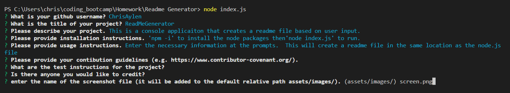

    
# ReadMe Generator

!This console app helps the user generate a readme file(https://img.shields.io/badge/license-MIT-blue.svg)
    
## Description
    
This console app helps the user generate a readme file

## Installation
    
npm-i
    
## Usage
    
run 'node index.js' and follow the prompts.
    
###Screenshot
        

    
## Credits

    
## License
    
This project is licenced under MIT
    
    
## Contributing
    

## Tests
    

## Questions

[ChrisAylen]Find more projects of mine here: https://github.com/ChrisAylen
    
